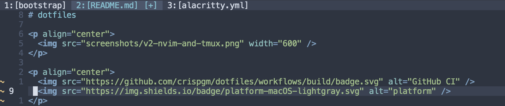

# nvim-tabline

A minimal Tabline plugin for Neovim, written in Lua.
It is basically a drop-in replacement for [tabline.vim](https://github.com/mkitt/tabline.vim) but with [a few differences](#Differences).



## Installation

With `lazy.nvim`:

```lua
{
    'crispgm/nvim-tabline',
    dependencies = { 'nvim-tree/nvim-web-devicons' }, -- optional
    config = true,
}
```

## Configuration

```lua
require('tabline').setup({opts})
```

### Defaults

```lua
require('tabline').setup({
    show_index = true,           -- show tab index
    show_modify = true,          -- show buffer modification indicator
    show_icon = false,           -- show file extension icon
    fnamemodify = ':t',          -- file name modifier
    modify_indicator = '[+]',    -- modify indicator
    no_name = 'No name',         -- no name buffer name
    brackets = { '[', ']' },     -- file name brackets surrounding
    inactive_tab_max_length = 0  -- max length of inactive tab titles, 0 to ignore
})
```

### Mappings

Vim's tabpage commands are powerful enough, `:help tabpage` for details.
If you need switch between tabs, [here is a great tutorial](https://superuser.com/questions/410982/in-vim-how-can-i-quickly-switch-between-tabs).

### Highlights

The highlighting of the tab pages line follows vim settings. See `:help setting-tabline` for details.

### Differences

nvim-tabline is not exactly a Lua translation. There are some differences for configuration:

- Control whether to display tab number (`show_index`) and buffer modification indicator (`show_modify`).
- File extension icon with nvim-dev-icons.
- Customize modify indicator and no name buffer name.
- Close button (`g:tablineclosebutton`) is not supported.
